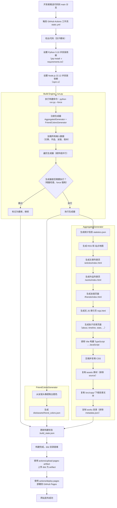

> 部分文本使用 AIGC 润色

## 1. 项目概述

本项目是一个**静态网站生成器 + 单页应用（SPA）** 的混合体，用于构建个人博客、作品集、友链、留言板、统计看板等功能的现代化网站。  
核心特点：

- **全自动化构建**：Python 脚本将 Markdown 文章、作品元数据、友链等转换为静态 HTML 和 JSON 数据。
- **前端 SPA 架构**：基于原生 JavaScript（TypeScript）模块，实现无刷新页面切换、按需加载、本地缓存与 Service Worker 离线支持。
- **丰富的交互体验**：暗黑模式、自定义光标、全局图片查看器、音乐播放器、动态图表、搜索与标签筛选、阅读进度、通用跳转弹窗等。
- **开发者友好**：模块化设计，易于扩展新页面、新生成器，支持并行构建和增量更新。

---

## 2. 技术栈总览

| 层级 | 技术选型 |
|------|----------|
| **构建系统** | Python 3.9+，依赖 `markdown`、`PyYAML`、`python-dateutil`、`rcssmin` |
| **前端语言** | TypeScript（主要）、JavaScript（部分传统模块） |
| **构建工具** | Vite（用于 TypeScript 编译与打包） |
| **样式** | 原生 CSS，CSS 变量，模块化设计（core / components / pages） |
| **数据格式** | JSON（文章、作品、统计、友链、版本日志） |
| **路由与导航** | 自定义 History API 路由，无刷新 AJAX 内容替换 |
| **状态管理** | 单例模式 + `localStorage`（主题、缓存、设置） |
| **图表** | Chart.js 4.4（动态加载） |
| **评论** | [Twikoo](https://twikoo.js.org) |
| **统计** | [vercount](https://www.vercount.one) |
| **图片查看器** | 自定义 Canvas 实现，支持缩放/旋转/拖拽 |
| **鼠标特效** | Canvas 2D 实时渲染（点击涟漪、长按爆发、拖拽连线） |
| **Service Worker** | 自定义缓存策略（stale-while-revalidate、网络优先） |
| **音乐播放器** | [APlayer 分支](https://github.com/DIYgod/APlayer/pull/802) |
| **通用跳转弹窗** | 自定义 `jump-dialog`，复用友链卡片样式，支持锚点放大动画、倒计时、自动跳转 |

---

## 3. 项目架构

### 3.1 整体流程

#### 整体数据流（构建 → 部署）



---

#### 前端初始化流程

```mermaid
flowchart TD
    A[用户访问页面] --> B[加载 HTML 文档]
    B --> C[加载 main.ts 入口]
    C --> D[DOMContentLoaded 事件触发]
    D --> E[AppInitializer.start 启动]

    subgraph AppInitializer[AppInitializer 应用启动编排器]
        direction TB
        E --> E1[添加优化标签<br>preconnect / preload]
        E1 --> E2[同步主题<br>getTimeBasedTheme]
        E2 --> E3[调度空闲任务<br>背景图加载]
        E3 --> E4[等待 loadNavbar<br>导航栏加载与渲染]
        E4 --> E5[非阻塞加载页脚<br>loadFooter]
        E5 --> E6[渲染个人卡片<br>renderPersonalCard]
        E6 --> E7[启动站点年龄更新器<br>startSiteAgeUpdater]
        E7 --> E8[初始化浮动按钮<br>initButtons]
        E8 --> E9[调度空闲任务<br>无刷新导航 + 列表点击]
        E9 --> E10[调度空闲任务<br>当前页面特性初始化]
        E10 --> E11[调度空闲任务<br>UI特效 / 数据预加载 / 图片]
        E11 --> E12[初始化 Clarity 分析<br>initClarityOnConsent]
        E12 --> E13[调度空闲任务<br>加载音乐播放器]
        E13 --> E14[初始化浏览器历史<br>initPopstate]
        E14 --> E15[显示加载覆盖层<br>LoadingOverlayManager.show]
        E15 --> E16[等待用户交互<br>点击继续]
        E16 --> E17[延迟 500ms 播放导航栏入场动画]
        E17 --> E18[标记加载完成<br>data-loaded="true"]
        E18 --> E19[初始化友链管理器<br>friendLinkManager.init]
        E19 --> E20[注册 Service Worker<br>registerServiceWorker]
    end

    subgraph IdleTasks[空闲任务调度 requestIdleCallback]
        direction LR
        I1[背景图加载<br>applyRandomBackgroundImage] --> I2[无刷新导航启用<br>enableAjaxNavigation]
        I2 --> I3[列表点击事件<br>handleListItemClick]
        I3 --> I4[页面特性初始化<br>initPageFeatures]
        I4 --> I5[UI特效初始化<br>initUIEffects]
        I5 --> I6[数据服务预加载<br>DataService 预热]
        I6 --> I7[图片懒加载<br>LazyImageLoader.init]
        I7 --> I8[全局图片查看器<br>GlobalImageManager.init]
        I8 --> I9[页脚更新时间<br>updateFooterUpdateTime]
        I9 --> I10[页脚统计信息<br>initFooterStats]
        I10 --> I11[音乐播放器<br>global-music-player]
    end

    subgraph Navbar[导航栏加载流程]
        direction TB
        N1[initNavbar] --> N2[NavbarManager.initNavbar]
        N2 --> N3[生成导航 DOM<br>createNavbarDOM]
        N3 --> N4[注入 CSS<br>navbar.css]
        N4 --> N5[挂载到 placeholder]
        N5 --> N6[绑定滚动事件]
        N6 --> N7[初始化主题切换<br>initThemeToggle]
        N7 --> N8[初始化导航高亮<br>initNavigation]
        N8 --> N9[初始化移动菜单<br>initMobileMenuToggle]
        N9 --> N10[创建标题占位<br>createTitlePlaceholder]
        N10 --> N11[播放入场动画<br>playEntranceAnimation]
    end

    subgraph PageInit[页面特性初始化]
        direction TB
        P1{页面类型判断} --> P2[index 首页<br>initHomePage]
        P1 --> P3[articles 列表<br>initSearchPage]
        P1 --> P4[works 列表<br>initSearchPage]
        P1 --> P5[timeline 归档<br>initArchivePage]
        P1 --> P6[stats 统计<br>initStatsPage]
        P1 --> P7[friends 友链<br>initFriendsPage]
        P1 --> P8[about 关于<br>initAboutPage]
        P1 --> P9[contact 留言板<br>initTwikoo]
        P1 --> P10[article-detail 详情<br>initArticlePage]
    end

    subgraph HomePage[首页初始化 home-manager]
        H1[加载统计与标签<br>loadStatisticsAndTags] --> H2[绑定导航事件<br>bindGlobalNavigateEvents]
        H2 --> H3[启动问候更新器<br>startGreetingUpdater]
        H3 --> H4[启动实时时钟<br>startLiveClock]
        H4 --> H5[设置滚动揭示<br>setupReveal]
        H5 --> H6[绑定名言刷新<br>bindQuoteRefresh]
        H6 --> H7[加载名言<br>loadQuote]
    end

    subgraph ArticlePage[文章详情初始化 article]
        A1[确保 TOC 结构<br>ensureTOCStructure] --> A2[初始化目录<br>initTOC]
        A2 --> A3[图片懒加载<br>initImageLazyLoad]
        A3 --> A4[阅读进度条<br>initReadingProgress]
        A4 --> A5[代码块复制<br>initCodeBlocks]
        A5 --> A6[移动端侧边栏<br>initMobileSidebar]
        A6 --> A7[滚动位置保存<br>initScrollSave]
        A7 --> A8[数学公式渲染<br>renderMath]
        A8 --> A9[初始化评论<br>initTwikoo]
        A9 --> A10[刷新访问统计<br>refreshvercount]
    end

    subgraph LoadingOverlay[加载覆盖层 loading-overlay-manager]
        L1[显示覆盖层] --> L2[添加系统日志]
        L2 --> L3[并行请求关键数据<br>statistics / articles / works<br>code / friends / version]
        L3 --> L4[解析统计数据]
        L4 --> L5[解析文章列表]
        L5 --> L6[解析作品列表]
        L6 --> L7[解析代码分析]
        L7 --> L8[解析友链]
        L8 --> L9[版本检测与比对]
        L9 --> L10{需要更新?}
        L10 -->|是| L11[渲染更新提示界面]
        L10 -->|否| L12[隐藏覆盖层]
        L11 --> L13[等待用户点击]
        L13 --> L12
    end

    subgraph CoreModules[核心模块依赖]
        C1[core.ts<br>配置 / 工具 / 存储] --> C2[data-service.ts<br>数据服务]
        C1 --> C3[page-utils.ts<br>页面工具]
        C1 --> C4[twikoo-manager.ts<br>评论管理]
        C2 --> C5[site-state.ts<br>SW注册 / 统计]
        C3 --> C6[theme.ts<br>主题切换]
        C6 --> C7[ui-effects.ts<br>滚动揭示 / 鼠标特效]
        C7 --> C8[router.ts<br>无刷新导航]
        C8 --> C9[页面管理器]
    end

    AppInitializer --> Navbar
    AppInitializer --> IdleTasks
    AppInitializer --> LoadingOverlay
    IdleTasks --> PageInit
    PageInit --> HomePage
    PageInit --> ArticlePage
    AppInitializer --> CoreModules

    E18 --> F[页面可交互]
```

### 3.2 目录结构（关键部分）

```
/
├── builder/                     # Python 构建系统
│   ├── build_context.py         # 数据类 (Article, Work, Friend, BuildContext)
│   ├── common.py                # 公共工具（日志、哈希、日期、文件IO）
│   ├── input_loader.py          # 加载所有源数据（解析 Markdown、frontmatter、作品元数据）
│   ├── engine.py                # 构建引擎（依赖解析、并行执行生成器）
│   ├── generators/
│   │   ├── base.py              # 生成器抽象基类
│   │   ├── friend_colors.py     # 友链卡片底色生成
│   │   └── aggregated.py        # 聚合生成器（统计、RSS、站点地图、列表页、静态资源复制）
│   └── run.py                   # CLI 入口
├── src/                         # 前端源码（TypeScript/JS/CSS）
│   ├── assets/                  # 静态资源（头像、源 Markdown 文章、作品文件）
│   │   ├── source/              # 文章分类子目录（内含 .md）
│   │   ├── works/               # 作品文件夹（每个子目录含 metadata.json 及资源）
│   │   └── avatar.webp
│   ├── css/                     # 样式（按 core / components / pages 分层）
│   ├── js/                      # JavaScript/TypeScript 源码
│   │   ├── core/                # 核心工具（配置、存储、页面管理器基类）
│   │   ├── router/              # 无刷新路由与导航
│   │   ├── pages/               # 各页面管理器（home, article, timeline, stats, friends, about）
│   │   ├── ui/                  # UI 组件（光标、图片查看器、主题切换、跳转弹窗、按钮管理）
│   │   ├── data/                # 数据处理（Worker、设置、Service Worker）
│   │   ├── vendor/              # 第三方库（音乐播放器）
│   │   └── entry/               # 入口文件 (main.ts)
│   └── templates/               # HTML 模板（用于构建生成静态页）
├── dist/                        # 构建输出目录（部署内容）
│   ├── articles/                # 文章详情页 (HTML)
│   ├── json/                    # 所有 JSON 数据（articles.json, works.json, statistics.json 等）
│   ├── css/, js/, assets/       # 静态资源（压缩/合并后）
│   ├── index.html, 404.html, about/, contact/, stats/, timeline/, friends/, settings/
│   └── ...
├── package.json, vite.config.ts # 前端构建配置
└── README.md
```

---

## 4. 构建系统详解

### 4.1 数据加载（`input_loader.py`）

#### 文章加载
- 扫描 `src/assets/source/` 下所有子目录，每个子目录作为 `category`。
- 对每个 `.md` 文件：
  - 解析 YAML frontmatter（支持 `title`, `date`, `description`, `author`, `tag`, `category`）。
  - 若无 frontmatter，使用简易解析。
  - 计算内容哈希，与 `json/articles.json` 中存储的哈希比对，决定是否重新生成 HTML。
  - 使用 `markdown` 库转换为 HTML，并注入：
    - 标题 `id` 自动生成（用于 TOC 锚点）。
    - 图片懒加载：`src` 替换为 `data-src`，添加占位 SVG。
    - 代码块语法高亮（`codehilite`）。
    - KaTeX 公式支持（通过页面 JS 的 `renderMathInElement`）。
  - 生成完整文章 HTML 页面（包含元数据、TOC、评论占位、统计脚本）。
  - 输出到 `dist/articles/`（隐藏文章进入 `.hidden/` 子目录）。
- 构建 `Article` 对象列表，并序列化到 `articles.json`。

#### 作品加载
- 遍历 `src/works/` 下每个子目录。
- 读取 `metadata.json`（格式见下文）。
- 若 `tag` 包含“隐藏”则排除。
- 生成 `Work` 对象列表，写入 `works.json`。

#### 友链加载
- 从 `dist/json/friends.json` 读取（手动维护）。
- 生成 `Friend` 对象列表。

#### 版本日志加载
- 解析 `src/assets/网站更新日志.md`，识别版本标题（`## vX.Y.Z (YYYY-MM-DD)`）和变更条目（`- **类型**: 描述`）。
- 生成 `version.json`，包含版本列表和哈希，用于前端版本检测。

### 4.2 生成器引擎（`engine.py`）

- `BuildEngine` 注册多个 `OutputGenerator`（目前仅 `AggregatedGenerator`）。
- **依赖检查**：每个生成器声明 `inputs`（需要的上下文属性）和 `outputs`（生成的文件路径）。
- **增量判断**：通过 `is_up_to_date` 比较上下文的组合哈希与上次构建存储的哈希，决定是否跳过。
- **执行方式**：
  - 串行（`--no-parallel`）或并行（默认，使用 `ThreadPoolExecutor`）。
  - 可指定 `--targets` 只运行特定生成器。
- `AggregatedGenerator` 一次性生成所有静态输出，避免重复加载数据。

### 4.3 聚合生成器（`aggregated.py`）功能

- **统计 JSON**：计算文章/作品总数、总字数、标签/分类计数、作者统计、更新时间等，写入 `statistics.json`。
- **RSS 2.0**：根据 `rss_config.json` 配置，生成包含文章和/或作品的 RSS Feed。
- **站点地图**：生成 `sitemap.xml`，包含所有公开文章和主要页面 URL。
- **文章/作品列表页**：生成 `articles/index.html` 和 `works/index.html`，内嵌完整数据（`window.__STATIC_ARTICLES_DATA` 等），加速首屏加载。
- **无JS回退页**：`nojs.html` 在禁用 JavaScript 时展示静态内容。
- **静态资源复制**：
  - 调用 Vite 构建 TypeScript → JavaScript。
  - 压缩并复制 CSS（使用 `rcssmin`）。
  - 复制 `assets/`（排除 `source/`, `avatars/`, `js/`, `css/` 等）。
  - 复制 `favicon.ico`、`robots.txt`、`CNAME` 等。
  - 复制 `works/` 目录（排除 `metadata.json`）到 `dist/works/` 供作品子页面使用。
- **子目录页面**：将 `templates/` 中的 `about.html`, `timeline.html`, `stats.html` 等复制到 `dist/` 对应子目录作为 `index.html`，保持干净 URL。

---

## 5. 前端架构

### 5.1 入口与启动流程（`entry/main.ts`）

1. **加载覆盖层**：显示加载日志，并行获取 `statistics.json`, `articles.json`, `works.json`, `code_analysis.json`, `friends.json`, `version.json`。
2. **版本检测**：对比本地存储的 `siteVersion` 与远程 `version.json`，若有更新则展示更新日志。
3. **主题初始化**：读取存储的主题偏好，若无则根据时段自动选择（6:00-18:00 浅色，其余深色）。
4. **加载导航栏与页脚**：通过 `navbar-manager.ts` 和 `loadFooter()` 动态加载 HTML 片段。
5. **启动路由**：启用 `enableAjaxNavigation`，拦截内部链接点击，使用 `fetchAndReplaceContent` 无刷新切换页面。
6. **页面管理器调度**：根据当前路径，动态导入对应页面管理器（`home-manager`, `article`, `timeline`, `stats`, `friends`, `about` 等）。
7. **初始化全局 UI**：自定义光标、外链拦截（基于 `jump-dialog` 通用弹窗）、滚动揭示、图片查看器、音乐播放器（空闲时加载）。
8. **注册 Service Worker**（生产环境）。

### 5.2 路由系统（`router/router.ts`）

- **核心函数**：`fetchAndReplaceContent(url, pushState, scrollData)`
  1. 获取新页面 HTML（`fetch`）。
  2. 提取 `#router-view` 内容、标题、样式、脚本、导航栏/页脚片段。
  3. 执行退出动画，替换 `#router-view`，注入新样式，执行新脚本。
  4. 更新浏览器历史记录（`pushState` 或 `replaceState`），恢复滚动位置。
  5. 销毁当前页面管理器，初始化新页面管理器。
  6. 触发 `ajax:navigation` 自定义事件，供其他模块监听。
- **回退/前进支持**：监听 `popstate`，调用 `fetchAndReplaceContent` 并传递保存的滚动数据。
- **预加载**：在空闲时预加载 JSON 数据（`preloadCriticalJSON`）。

### 5.3 页面管理器基类（`core/page-manager.ts`）

- 所有页面管理器继承自 `PageManager`，必须实现 `init()` 和 `destroy()` 方法。
- `init()` 负责该页面的特定初始化和事件绑定。
- `destroy()` 负责清理事件监听、定时器、观察者，防止内存泄漏。

**已实现的管理器**：
- `HomePageManager`：加载统计数据、标签云、动态问候语，绑定统计卡片和标签点击跳转。
- `ArticlePageManager`：构建 TOC、阅读进度、代码复制、图片懒加载、移动端侧边栏、滚动保存。
- `ArchiveManager`：年份胶囊筛选、类型筛选、时间线渲染。
- `StatsManager`：加载 Chart.js，渲染多张图表（趋势、分类、标签、代码占比等），秒级更新运行时间。
- `FriendsPageManager`：Twikoo 初始化、JSON 示例复制、友链随机排序（每 10 秒洗牌），同时使用 `bindJumpTriggers` 为友链卡片绑定跳转弹窗（复用 `friends.css` 样式）。
- `AboutPageManager`：年龄经验值进度条、翻转卡片、GitHub 贡献图、Twikoo。
- `SearchController`（用于 articles/works 列表页）：Web Worker 驱动的过滤/排序。

### 5.4 数据管理与搜索（`pages/search-render.ts`）

- **DataManager**：负责从 `/json/` 获取数据，缓存到 `localStorage`（带时间戳，5 分钟过期），支持强制刷新。
- **SearchController**：
  - 绑定搜索输入框、字段选择器、排序下拉、标签按钮。
  - 使用 **Web Worker** (`searchWorker.js`) 进行过滤和排序，避免阻塞主线程。
  - 支持 URL 参数同步（`q`, `field`, `tags`, `sort`），便于分享和书签。
  - 标签按钮动态从数据中提取所有标签及其计数，点击筛选。
- **UIRenderer**：生成列表项 HTML，区分文章和作品（作品点击弹窗展示详情）。

### 5.5 UI 组件详解

#### 通用跳转弹窗（`ui/jump-dialog.ts`）
- 提供 `showJumpDialog` 命令式 API 和 `bindJumpTriggers` 声明式绑定。
- 完全复用 `friends.css` 中的 `.friend-link-overlay`、`.friend-link-content` 等样式，统一视觉风格。
- 支持从指定锚点元素放大展开（卡片放大动画）、倒计时自动跳转、ESC/点击背景关闭、自定义头像/描述/跳转目标。
- 被 `ExternalLinkManager` 和 `FriendsPageManager` 共同使用，替代了原有的独立外链确认弹窗。

#### 自定义光标（`ui/ui-effects.ts` - `CustomCursor`）
- 使用 Canvas 与 CSS 结合，绘制钢笔尖形状（SVG 路径）。
- 根据鼠标移动速度动态旋转（方向跟随），悬停在可点击元素上吸附到右下角。
- 集成鼠标特效（点击涟漪、长按爆发、拖拽连线）作为子模块。

#### 鼠标特效引擎（`MouseEffectManager`）
- 基于 Canvas 渲染，使用对象池管理粒子与连线。
- **点击**：产生 1-3 个同心圆环，向外扩散并淡出。
- **长按**（>100ms）：产生多个粒子向随机方向飞散，形成爆发效果。
- **拖拽**：在长按后移动鼠标，显示虚线连线和端点圆点，松开时形成收束线条。

#### 图片查看器（`ui/image-viewer.ts`）
- 点击任何图片（排除某些类）自动打开全屏查看器。
- 支持触控（指针事件）和键盘：缩放（+/-）、旋转（R）、方向键切换、ESC 关闭。
- 拖拽平移（缩放≥1 时），双击重置。
- 支持画廊模式：自动收集当前容器内所有图片，按点击顺序展示。
- 错误处理：图片加载失败时显示详细错误信息和重载按钮。

#### 主题切换（`ui/theme.ts`）
- 切换 `html` 元素的 `data-theme` 属性（`light`/`dark`）。
- 切换时播放淡入淡出遮罩过渡动画。
- 用户手动切换时保存到 `localStorage`，否则自动根据时段或系统偏好（无保存时）。

#### 导航栏管理器（`ui/navbar-manager.ts`）
- 完全由 JS 生成导航栏 DOM，无需 HTML 片段。
- **标题替换模式**：在桌面端且没有激活的导航项时，将导航项替换为当前页面标题，鼠标悬停恢复导航项，鼠标移出恢复标题。
- 标题过长时自动滚动（使用 CSS 动画）。
- 入场动画：首次加载后延迟执行淡入（由 `main.ts` 调用）。

#### 服务工作者（`data/sw.js`）
- 缓存策略：
  - JSON/API 请求：`stale-while-revalidate`，优先返回缓存，后台更新。
  - 静态资源（CSS/JS/图片）：`stale-while-revalidate`，缓存优先，定期更新。
  - HTML 页面：`network-first`，离线时回退缓存。
- 开发环境自动跳过 SW，生产环境自动注册。
- 提供 `clearAllServiceWorkerCache` 全局函数，用于设置页面清除缓存。

---

## 6. 关键数据流

### 6.1 文章发布流程

```
1. 作者在 src/assets/source/分类/ 下新建 .md 文件（含 frontmatter）
2. 运行 python run.py
3. input_loader 解析 MD，生成 HTML 到 dist/articles/
4. 更新 dist/json/articles.json
5. aggregated 生成统计、RSS、站点地图
6. 静态资源复制（Vite 构建 JS/CSS）
7. 部署 dist/ 到服务器
```

### 6.2 前端页面加载流程（以文章详情为例）

```
1. 用户点击文章链接（或直接输入 URL）
2. router 拦截，fetch 获取 /articles/xxx.html
3. 提取 #router-view 内容，替换
4. 执行新页面中的脚本（article.ts 初始化）
5. ArticlePageManager：
   - 读取 window.ARTICLE_HEADINGS（由构建时注入）
   - 构建 TOC 并绑定点击滚动
   - 初始化阅读进度条
   - 启用图片懒加载（IntersectionObserver）
   - 初始化 Twikoo 评论（动态加载库）
   - 启动数学公式渲染（KaTeX）
   - 更新不蒜子统计
6. 记录滚动位置到 sessionStorage（返回时恢复）
```

### 6.3 搜索与筛选流程（文章/作品列表）

```
1. 页面加载时，DataManager 从缓存或网络获取数据。
2. SearchController 从 URL 解析查询参数（q, field, tags, sort）。
3. 将数据、查询条件发送给 Web Worker。
4. Worker 过滤、排序后返回结果。
5. UIRenderer 生成 HTML，替换列表容器。
6. 滚动揭示效果重新触发（ScrollReveal）。
7. 用户修改搜索/标签/排序时，更新 URL 并重复上述过程。
```

---

## 7. 数据格式规范

### 7.1 文章 Frontmatter（YAML）

```yaml
---
title: 文章标题
date: 2026-05-24
description: 简介
author: 高新炀
tag: [随笔, 生活]
category: 随笔   # 可选，默认使用所在子目录名
---
```

- `date` 支持 `YYYY-MM-DD` 或 `YYYY年MM月DD日`。
- `tag` 可为数组或逗号分隔字符串。
- 包含 `隐藏` 标签的文章将不出现在列表/RSS/统计中，但仍生成 HTML 到 `.hidden/`。

### 7.2 作品元数据（`works/作品名/metadata.json`）

```json
{
  "title": "作品标题",
  "date": "2026-01-01",
  "description": "描述",
  "author": "高新炀",
  "tag": ["工具", "游戏"],
  "link": "https://example.com"   // 可留空，默认指向 /works/作品名/
}
```

### 7.3 友链（`dist/json/friends.json`）

```json
[
  {
    "name": "站点名称",
    "link": "https://example.com",
    "desc": "描述",
    "avatar": "https://example.com/avatar.png"
  }
]
```

### 7.4 统计 JSON（`statistics.json`）字段

| 字段 | 说明 |
|------|------|
| `version` | 版本号（来自更新日志最新版本 ID） |
| `last_updated` | 最新更新日期 |
| `total_articles` | 文章总数 |
| `total_word_count` | 总字数 |
| `total_works` | 作品总数 |
| `article_tags` | `[{name, count}, ...]` 按次数降序 |
| `article_categories` | 同 `article_tags` |
| `work_tags` | 同 `article_tags` |
| `total_update_days` | 有更新的日期天数 |

---

## 8. 开发与扩展指南

### 8.1 添加新页面

1. 在 `src/templates/` 下创建新的 HTML 模板，包含 `#navbar-placeholder`、`#personal-card-container`、`#footer-placeholder`、`#router-view` 等占位。
2. 在 `builder/generators/aggregated.py` 的 `PAGE_TEMPLATES` 字典中添加映射（模板名 → 子目录），以在构建时复制到 `dist/`。
3. （可选）若页面需要动态初始化，在 `src/js/pages/` 下创建对应的页面管理器（继承 `PageManager`），并导出 `initXxxPage` 函数。
4. 在 `src/js/router/router.ts` 的 `initPageManagerByPageName` 中添加分支，动态导入并初始化该管理器。
5. 在导航栏（`navbar-manager.ts` 的 `links` 数组）中添加链接项。
6. 重新运行构建。

### 8.2 自定义生成器

若需扩展构建输出（如生成 JSON 摘要、额外页面等），可继承 `OutputGenerator`：

```python
from builder.generators.base import OutputGenerator
from builder.build_context import BuildContext

class MyGenerator(OutputGenerator):
    name = "mygen"
    inputs = {"articles", "works"}   # 依赖的上下文属性
    outputs = [Path("dist/myfile.json")]

    def generate(self, context: BuildContext, force: bool) -> bool:
        # 使用 context.articles, context.works 等生成
        return True
```

然后在 `run.py` 中注册：

```python
engine.register(MyGenerator())
```

### 8.3 修改前端构建（Vite）

- 入口文件：`src/js/entry/main.ts`。
- Vite 配置：`vite.config.ts` 将 `src/js` 映射为 `/js`，构建输出到 `dist/`（`preserveModules` 保持目录结构）。
- 生产构建通过 Python 构建系统调用 `npm run build` 触发 Vite。

### 8.4 调试技巧

- **构建日志**：`builder/common.py` 提供 `log_info/warning/error`，彩色输出。
- **前端调试**：Chrome DevTools，查看 `localStorage` 中的缓存数据（`articlesData`, `worksData` 等）。
- **性能分析**：`core/core.ts` 中的 `PerformanceMonitor` 自动记录关键操作耗时，超过 100ms 会输出警告。
- **Service Worker**：可在 Chrome Application 面板中手动注销或更新。

---

## 9. 部署说明

1. 安装依赖：`pip install markdown pyyaml python-dateutil rcssmin`
2. 安装 Node.js 依赖：`npm install`（用于 Vite）
3. 运行构建：`python run.py`（或 `python run.py --nogui`）
4. 构建产物位于 `dist/` 目录。
5. 将 `dist/` 内容上传到静态托管平台（如 GitHub Pages、Netlify、Vercel）。
6. 确保 `CNAME` 文件内容为自定义域名（如需）。
7. 若使用 Twikoo，需部署云函数并更新各页面中的 `envId`。

---

## 10. 许可证

- **代码**：MIT License
- **文章内容**：CC BY-NC-ND 4.0（除特别声明外）

---

*本文档持续更新，以项目最新代码为准。*  
*维护者：高新炀*  
*最后更新：2026-07-12*