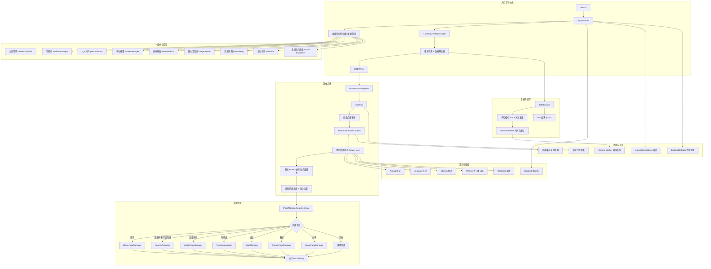

## 1. 概述

我的个人网站。

---

## 2. 技术栈

项目为前后端分离静态站点生成架构。

| 层级 | 技术 | 说明 |
|------|----------|-----------|
| **构建系统** | Python 3.12+ | 运行构建脚本（`run.py`），处理 Markdown 解析、数据聚合、静态资源生成 |
| **Markdown 解析** | `markdown` + `pymdown-extensions` | 支持 Frontmatter、Admonition、任务列表、选项卡、代码高亮、数学公式（KaTeX 前端渲染） |
| **数据序列化** | `PyYAML`、`json` | 解析文章 Frontmatter、作品元数据、友链 JSON |
| **颜色提取** | `requests` + `Pillow` | 为友链头像提取主色调，生成 `friend_colors.json` |
| **CSS 压缩** | `rcssmin` | 构建时压缩 CSS 文件 |
| **日期处理** | `python-dateutil`、`packaging` | 解析多种日期格式，版本号排序 |
| **前端语言** | TypeScript 6.0.3 | 所有交互逻辑、页面管理器、路由、UI 组件均使用 TypeScript 编写，部分传统模块为 JavaScript |
| **前端构建工具** | Vite 8.1.1 | 编译 TypeScript、打包模块、复制 vendor 库，支持 HMR 开发服务器 |
| **路由与 SPA** | 原生 History API + 自定义 Router | 无刷新页面切换，支持 `popstate`、滚动位置恢复、内存页面缓存（LRU 清理）、资源动态加载/卸载 |
| **状态管理** | 单例模式 + 内存缓存 + Service Worker | `DataService` 负责内存缓存与并发去重，持久化缓存由 Service Worker 负责；`storageController` 管理 localStorage 设置、访客记录等 |
| **样式系统** | 原生 CSS + CSS 变量 | 模块化设计：`core/`（变量、布局、基础）、`components/`（导航、评论、页脚等）、`pages/`（各页面独有样式），支持明暗主题自动切换 |
| **图表渲染** | Chart.js 4.4.0 | 统计仪表板动态加载，绘制文章趋势、分类占比、标签排行、代码分布等图表，主题自适应 |
| **评论系统** | Twikoo 1.7.22 | 无后端评论，部署于 Netlify Functions，支持 Markdown、邮件通知 |
| **访问统计** | vercount | 基于 `vercount.one` 服务，统计站点/页面 PV、UV，兼容不蒜子数据属性 |
| **隐私统计** | Microsoft Clarity | 通过 `clarity.ts` 初始化，站点默认同意统计，SPA 导航时更新页面视图 |
| **图片查看器** | 自定义 DOM + CSS Transform | 支持缩放（滚轮/双指）、旋转、拖拽、键盘快捷键、全屏、画廊模式，无第三方依赖 |
| **鼠标特效** | Canvas 2D 渲染 | 自定义光标（圆点+圆环）、长按连线拖拽、释放爆发粒子，帧率自适应、空闲暂停 |
| **音乐播放器** | APlayer | 悬浮播放器，自动加载网易云歌单，支持歌词显示、音量控制、播放列表 |
| **通用弹窗** | `jump-dialog` + `detail-dialog` | 基于原生 DOM 构建，复用友链卡片样式，支持锚点放大动画、倒计时自动跳转、键盘操作 |
| **Service Worker** | 自定义 `sw.js` | 精细化缓存策略：静态资源（Cache First）、JSON 数据（Stale-While-Revalidate）、HTML 文档（Network First），启用 Navigation Preload |
| **数据格式** | JSON（API 数据）、YAML（文章 Frontmatter） | 所有内容数据（文章、作品、统计、友链、版本日志）均以 JSON 形式提供给前端，构建时生成 |
| **部署** | GitHub Actions + GitHub Pages | 自动化构建部署，详见 `.github/workflows/static.yml`（构建 / 部署拆分为两个作业） |

运行期版本由以下文件统一锁定，本地与 CI 共用同一份来源：

| 文件 | 作用 |
|------|------|
| `.python-version` | Python 版本（`setup-python` 的 `python-version-file`） |
| `.nvmrc` | Node.js 版本（`setup-node` 的 `node-version-file`） |
| `requirements.txt` | Python 依赖（锁定下限，CI 用 pip 缓存加速） |
| `package-lock.json` | Node 依赖（CI 用 `npm ci` 精确还原） |

---

### 依赖版本详情

#### Python 依赖（`requirements.txt`）
```
markdown               # 核心 Markdown 解析
pyyaml                 # Frontmatter 解析
requests               # 友链头像下载
pillow                 # 图像主色提取
rcssmin                # CSS 压缩
python-dateutil        # 日期解析
packaging              # 版本号排序
pymdown-extensions     # 扩展 Markdown 语法
```

#### Node.js 依赖（`package.json`）

```json
{
  "devDependencies": {
    "typescript": "^6.0.3",
    "vite": "^8.1.1",
    "rollup-plugin-copy": "^3.5.0"
  }
}
```

---

## 快速开始

```bash
# 1) 安装依赖
python -m pip install -r requirements.txt
npm ci                    # 或 npm install

# 2) 开发预览
npm run dev               # Vite dev server
python run.py             # 生成 dist（内容侧产物 + 前端编译）

# 3) 常用构建命令
python run.py             # 增量构建（默认）
python run.py --clean     # 清空 dist 后全量构建（发布前推荐）
python run.py --no-frontend   # 跳过 Vite，仅生成内容侧产物
python run.py --ci        # CI 模式：纯文本日志 + 前端失败即失败
```

---

## 3. 目录结构

```txt
Website
├─ .github
│  └─ workflows
│     └─ static.yml
├─ builder
│  ├─ generators
│  │  ├─ aggregated.py
│  │  ├─ base.py
│  │  └─ friend_colors.py
│  ├─ build_context.py
│  ├─ common.py
│  ├─ config.py
│  ├─ engine.py
│  ├─ input_loader.py
│  ├─ static_assets.py
│  └─ __init__.py
├─ dist
├─ node_modules
├─ src
│  ├─ assets
│  │  ├─ source
│  │  │  ├─ 分类一
│  │  │  │  └─ 马生复宋濂书.md
│  │  │  └─ 分类二
│  │  │     └─ 网站的起源.md
│  │  ├─ avatar.webp
│  │  ├─ friends.json
│  │  ├─ friend_colors.json
│  │  └─ 网站更新日志.md
│  ├─ public                      # 原样发布到 dist 根目录（约定式，加文件即可）
│  │  ├─ .well-known
│  │  │  └─ vercount-verify-pof0sq1cg39g4rpkl66s6rtf.txt
│  │  ├─ BingSiteAuth.xml
│  │  ├─ favicon.ico
│  │  └─ robots.txt
│  ├─ css
│  │  ├─ components
│  │  │  ├─ comments.css
│  │  │  ├─ footer.css
│  │  │  ├─ github-contrib-graph.css
│  │  │  ├─ image-viewer.css
│  │  │  ├─ loading-overlay.css
│  │  │  ├─ navbar.css
│  │  │  └─ tooltip.css
│  │  ├─ core
│  │  │  ├─ base.css
│  │  │  ├─ components.css
│  │  │  ├─ layout.css
│  │  │  └─ variables.css
│  │  ├─ pages
│  │  │  ├─ 404.css
│  │  │  ├─ about.css
│  │  │  ├─ article.css
│  │  │  ├─ friends.css
│  │  │  ├─ home.css
│  │  │  ├─ stats.css
│  │  │  └─ timeline.css
│  ├─ js
│  │  ├─ core
│  │  │  ├─ app-initializer.ts
│  │  │  ├─ clarity.ts
│  │  │  ├─ core.ts
│  │  │  ├─ data-service.ts
│  │  │  ├─ disposable-stack.ts
│  │  │  ├─ modal-base.ts
│  │  │  ├─ page-manager.ts
│  │  │  ├─ page-utils.ts
│  │  │  ├─ scroll-dispatcher.ts
│  │  │  ├─ theme-controller.ts
│  │  │  └─ twikoo-manager.ts
│  │  ├─ data
│  │  │  ├─ settings.ts
│  │  │  ├─ site-state.ts
│  │  │  └─ sw.js
│  │  ├─ entry
│  │  │  └─ main.ts
│  │  ├─ pages
│  │  │  ├─ about.ts
│  │  │  ├─ article.ts
│  │  │  ├─ friends-manager.ts
│  │  │  ├─ home-manager.ts
│  │  │  ├─ search-render.ts
│  │  │  ├─ stats-manager.ts
│  │  │  ├─ timeline.ts
│  │  │  └─ stats
│  │  │     ├─ chart-registry.ts
│  │  │     └─ charts.ts
│  │  ├─ router
│  │  │  └─ router.ts
│  │  ├─ standalone
│  │  │  └─ 404.ts
│  │  ├─ ui
│  │  │  ├─ button-manager.ts
│  │  │  ├─ detail-dialog.ts
│  │  │  ├─ image-manager.ts
│  │  │  ├─ image-viewer.ts
│  │  │  ├─ jump-dialog.ts
│  │  │  ├─ list-events.ts
│  │  │  ├─ loading-overlay-manager.ts
│  │  │  ├─ mouse-effects.ts
│  │  │  ├─ navbar-manager.ts
│  │  │  ├─ personal-card.ts
│  │  │  ├─ theme.ts
│  │  │  ├─ tooltip.ts
│  │  │  └─ ui-effects.ts
│  │  └─ vendor
│  │     ├─ APlayer.min.js
│  │     ├─ browser.global.min.js
│  │     ├─ global-music-player.ts
│  │     └─ vercount.min.js
│  ├─ templates
│  │  ├─ 404.html
│  │  ├─ about.html
│  │  ├─ contact.html
│  │  ├─ footer.html
│  │  ├─ index.html
│  │  ├─ privacy.html
│  │  ├─ stats.html
│  │  └─ timeline.html
│  └─ works
│     ├─ 作品一
│     │  └─ metadata.json
│     └─ 作品二
│        ├─ index.html
│        └─ metadata.json
├─ .gitignore
├─ .gitmodules
├─ .nvmrc
├─ .python-version
├─ CNAME
├─ LICENSE
├─ package-lock.json
├─ package.json
├─ pyproject.toml
├─ README.md
├─ requirements.txt
├─ run.py
└─ vite.config.mts
```

---

## 4. 构建系统详解

将源码（Markdown、元数据、前端资源）转换为可部署的静态网站。整个系统由 Python 编写，模块化设计，支持增量构建、并行执行和扩展。

### 4.1 核心组件

| 组件 | 文件 | 职责 |
|------|------|------|
| **数据模型** | `build_context.py` | 定义 `Article`、`Work`、`Friend`、`BuildContext` 等数据结构，作为构建上下文在各模块间传递。 |
| **公共工具** | `common.py` | 提供日志、JSON 读写、哈希计算、日期格式化、路径处理等通用函数。 |
| **输入加载器** | `input_loader.py` | 扫描 `src/assets/source/` 下的 Markdown 文件、`src/works/` 下的作品元数据、`src/assets/friends.json` 友链以及 `src/assets/网站更新日志.md`，解析后填充 `BuildContext`。 |
| **构建配置** | `config.py` | 定义 `BuildConfig`（force / clean / skip_frontend / offline / strict / parallel / max_workers / dry_run / ci），一次构建的所有开关集中在此，经 `BuildContext.options` 下发给各生成器。 |
| **构建引擎** | `engine.py` | 管理所有生成器（`OutputGenerator`），协调执行顺序，支持串行/并行运行，并依据 `.build_state.json` 进行增量判断；返回 `BuildReport` 汇总耗时与结果。 |
| **生成器基类** | `generators/base.py` | 定义生成器抽象接口，包含 `name`、`inputs`、`outputs`、`generate()` 等方法，以及输入哈希计算和状态更新逻辑。 |
| **静态资源同步** | `static_assets.py` | 声明式管理所有“非构建资源”（`AssetRule`）：统一负责 `src/public/`、`src/assets/`、`src/works/`、模板页与友链 JSON 的发布，并基于内容哈希做增量复制。 |
| **聚合生成器** | `generators/aggregated.py` | 核心生成器，负责生成绝大部分输出：统计 JSON、RSS、站点地图、文章/作品/友链列表页、无 JS 回退页、复制静态资源（CSS、JS、素材）等。 |
| **友链颜色生成器** | `generators/friend_colors.py` | 独立生成器，通过下载友链头像并提取主色调，生成 `friend_colors.json` 用于前端卡片背景色。 |
| **入口脚本** | `run.py` | 命令行入口，解析参数，注册生成器，启动构建引擎。 |

### 4.2 构建流程

1. **装配配置**：`run.py` 依据命令行 + 环境变量构造 `BuildConfig`，必要时清理 `dist/`（`--clean`）。
2. **加载输入**：`InputLoader` 读取所有源文件，生成 `BuildContext` 对象（`ctx.options` 携带本次构建配置）。
3. **生成器注册**：在 `run.py` 中注册 `FriendColorsGenerator` 和 `AggregatedGenerator`。
4. **增量判断**：引擎检查每个生成器的输出文件是否都存在，并比对输入数据的哈希值（以及前端资源的哈希），若未变化则跳过。
5. **执行生成**：按依赖分层，层内并行调用各生成器的 `generate()` 方法，将结果写入 `dist/` 目录。
6. **更新状态**：成功生成后，将当前输入哈希（及 `AggregatedGenerator` 的前端哈希）与时间戳写入 `.build_state.json`，供下次增量判断使用。

### 4.3 增量构建机制

- **状态文件**：`.build_state.json` 存储每个生成器上次运行的“输入哈希”和“前端哈希”，并带 `_version` 字段；格式或哈希算法升级时旧状态自动失效，退化为一次全量构建。
- **输入哈希**：由生成器声明的依赖（如 `articles`、`works`）的序列化内容计算而得，任一源文件改动都会导致哈希变化。
- **前端哈希**：`AggregatedGenerator` 额外监控 `src/css/`、`src/js/`，再加上 `static_assets.static_sources_hash()`——它由静态资源规则自动派生（覆盖 `src/public/`、`src/assets/`、`src/works/`、模板页与友链 JSON），新增规则无需同步维护哈希清单；该哈希通过重写 `build_state_entry()` 写入，否则前端未变化也会每次触发 Vite 编译。
- **哈希算法**：统一使用 BLAKE2b(128bit)。相比 MD5 更快，且在启用 FIPS 的运行环境中不会报错。
- **产物一致性**：所有由构建系统写出的文本/JSON 统一使用 LF 换行，避免 Windows 本地构建与 CI（Linux）产物出现换行差异。
- **强制重建**：通过 `--force` 参数可忽略所有增量判断，强制全量构建；`--force-colors` 可单独强制更新友链颜色。

### 4.4 生成器详解

#### AggregatedGenerator（聚合生成器）

这是最主要的生成器，其 `generate()` 方法依次执行以下任务：

- **统计生成**：统计文章数、总字数、标签/分类频次、作者数、更新天数等，写入 `dist/json/statistics.json`。
- **RSS 生成**：从文章和作品中提取条目，按时间排序生成 `dist/rss.xml`。
- **站点地图**：生成 `dist/sitemap.xml`，包含所有文章及固定页面。
- **文章列表页**：渲染 `dist/articles/index.html`，包含标签筛选、搜索框、排序功能，数据通过 `window.__STATIC_ARTICLES_DATA` 注入。
- **作品列表页**：渲染 `dist/works/index.html`，类似文章列表，数据通过 `window.__STATIC_WORKS_DATA` 注入。
- **友链页面**：渲染 `dist/friends/index.html`，包含友链卡片（带主题色）和申请要求说明。
- **无 JS 回退页**：生成 `dist/nojs.html`，提供完全静态的内容列表，方便搜索引擎或禁用 JavaScript 的用户访问。
- **子目录页面**：将 `src/templates/` 下的 `about.html`、`timeline.html`、`stats.html`、`contact.html`、`privacy.html` 复制到对应的 `dist/about/`、`dist/timeline/` 等目录。
- **前端构建**：跨平台调用 `npm run build`（Windows 自动使用 `npm.cmd` 并做引号转义）编译 TypeScript，实时流式输出 Vite 日志；**默认失败即中止整个构建**（`--no-strict` 可恢复旧的宽容行为）。可用 `--no-frontend` 跳过。
- **CSS 压缩**：使用 `rcssmin` 压缩 `src/css/` 并输出到 `dist/css/`。
- **静态资源同步**：调用 `static_assets.sync_static_assets()`，一次同步所有非构建资源，见下节。
- **代码分析**：生成 `dist/json/code_analysis.json`，记录 `dist/` 目录下各文件类型的数量、大小和行数统计，便于监控构建产物规模。

#### FriendColorsGenerator（友链颜色生成器）

- **功能**：为每个友链的头像图片提取主色调，生成 `src/assets/friend_colors.json`（映射：网站链接 → [R, G, B]）。
- **缓存**：头像图片会被缓存到临时目录，避免重复下载。
- **依赖**：需 `requests` 和 `Pillow` 库，若未安装则生成器跳过（但构建不会失败，只会使用默认灰色）。
- **增量**：默认只处理新增或缺失颜色的友链，使用 `--force-colors` 可强制刷新所有；已删除的友链颜色会被自动清理。
- **并发与容错**：头像下载使用带重试的连接池 + 线程池并发（默认 8 并发，`FRIEND_COLOR_WORKERS` 可调），结果缓存到 `FRIEND_AVATAR_CACHE_DIR`（默认系统临时目录，CI 中挂在 `actions/cache`）；单个站点失败时**保留已有颜色**，只有从未取到颜色的友链才会落到默认灰色，不会因网络抖动让已缓存的颜色来回变化。`--offline` / `SKIP_NETWORK=1` 可完全跳过网络请求。
- **持久化缓存**：`src/assets/friend_colors.json` 随仓库提交，本地与 GitHub Actions 共用同一份历史颜色，只为新增友链发起请求；该文件缺失时日志会明确告警（CI 中另有校验步骤直接失败，避免静默退化为全量抓取）。

#### 静态资源规则（`builder/static_assets.py`）

所有“非构建资源”（原样复制的文件）都在 `STATIC_ASSET_RULES` 中声明，构建流程里不再散落 `shutil.copy` / `copytree` 调用：

| 源 | 目标 | 说明 |
|------|------|------|
| `src/public/**` | `dist/**` | 站点根文件：`favicon.ico`、`robots.txt`、`BingSiteAuth.xml`、`.well-known/` 验证文件。**新增根文件放进该目录即可发布，无需改代码** |
| `src/assets/**` | `dist/assets/**` | 全局素材（头像、图片、更新日志），排除 `source/`（Markdown 源） |
| `src/works/**` | `dist/works/**` | 作品子页面资源，排除 `metadata.json`（仅构建期使用） |
| `src/assets/*.json` | `dist/json/*.json` | 友链数据与主题色，直接作为 `/json` 接口发布 |
| `src/templates/*.html` | `dist/` 或 `dist/<子目录>/index.html` | 首页 / 404 / 页脚片段，以及 `PAGE_TEMPLATES` 定义的子目录页 |

规则语义：

- `source` 为**目录**：递归复制，按 `include` / `exclude` 过滤并保持相对结构；
- `source` 为 **glob**（如 `src/assets/*.json`）：复制所有匹配文件，保持相对“通配根”的结构；
- `source` 为**单文件**：复制到 `destination`，可顺便重命名（如 `about.html` → `about/index.html`）。

同步行为：

- **增量**：目标与源一致（size + mtime 相同，或内容哈希相同）即跳过写入，避免无意义写盘与 mtime 抖动；复制用 `copy2` 保留 mtime，跨平台表现一致；
- **并行**：文件复制走线程池（`MAX_SYNC_WORKERS`，可用 `cfg.parallel=False` 关闭）；
- **安全**：默认排除 `.git` / `.github` / `__pycache__` / `.DS_Store` 等元数据（不影响需要发布的 `.well-known/`）；标记 `required=True` 的源缺失会记为错误，并在严格模式（CI 默认）下中止构建；
- **增量联动**：`static_sources_hash()` 由规则自动派生并计入前端哈希，新增规则无需再维护一份哈希清单。

扩展方式：新增一类资源只需追加一条 `AssetRule`，生成器代码保持不变。

### 4.5 命令行用法

```bash
# 增量构建（默认，最快）
python run.py

# 全量构建（忽略增量状态）
python run.py --force

# 清空 dist 目录后全量构建（发布前推荐，避免残留旧文件被发布）
python run.py --clean

# 仅强制更新友链颜色（其他生成器仍按增量判断）
python run.py --force-colors

# 只运行指定生成器（如只生成友链颜色）
python run.py --targets friend_colors

# 跳过前端编译，只生成内容侧产物（写 Markdown / 调 API 时最快）
python run.py --no-frontend

# 离线构建：跳过所有网络请求（友链头像等）
python run.py --offline

# CI 模式：纯文本日志 + 严格模式（等价于 CI=true python run.py）
python run.py --ci

# 宽容模式：前端编译失败仍继续构建（默认失败即中止）
python run.py --no-strict

# 禁用并行执行 / 调整并行线程数（默认自动：CI=4，本地取 CPU 数量且 ≤8）
python run.py --no-parallel
python run.py --workers 6

# 预览执行计划而不真正生成
python run.py --dry-run

# 列出可用生成器
python run.py --list
```

### 4.5.1 环境变量

| 变量 | 作用 |
|------|------|
| `CI` / `GITHUB_ACTIONS` | 自动开启 CI 模式（纯文本日志、严格模式） |
| `NO_COLOR` / `FORCE_COLOR` | 手工控制日志着色 |
| `LOG_LEVEL` | 日志级别（默认 `INFO`，排错可设 `DEBUG`） |
| `BUILD_WORKERS` | 默认并行线程数 |
| `FRIEND_COLOR_WORKERS` | 友链头像并发数 |
| `FRIEND_AVATAR_CACHE_DIR` | 头像字节缓存目录（默认系统临时目录；CI 中指向 `.cache/friend-avatars` 并配合 `actions/cache`） |
| `SKIP_NETWORK` | 等价于 `--offline` |
| `VITE_BUILD_TIMEOUT` | 前端编译超时秒数（默认 900） |

### 4.6 依赖与环境

- **版本来源**：Python 版本取自 `.python-version`，Node.js 版本取自 `.nvmrc`，CI 与本地共用，避免“我这儿能跑”。
- **Python 依赖**：见 `requirements.txt`（锁定下限），主要包括 `markdown`、`pyyaml`、`requests`、`pillow`、`rcssmin`、`python-dateutil`、`packaging`、`pymdown-extensions`。
- **Node.js 依赖**：用于前端 TypeScript 编译，见 `package.json`，使用 Vite 作为构建工具。
- **代码规范**：`pyproject.toml` 提供项目元数据与 ruff / black 配置。
- **安装命令**：

```bash
python -m pip install -r requirements.txt
npm ci
```

### 4.7 扩展新生成器

若需增加自定义输出（如生成 JSON 摘要、额外页面），可继承 `OutputGenerator` 基类并实现抽象方法，然后在 `run.py` 中注册。例如：

```python
from builder.generators.base import OutputGenerator
from builder.build_context import BuildContext

class MyGenerator(OutputGenerator):
    name = "mygen"
    inputs = {"articles"}
    outputs = [Path("dist/my.json")]

    def generate(self, context: BuildContext, force: bool) -> bool:
        # 使用 context.articles 生成 my.json
        return True
```

注册：

```python
engine.register(MyGenerator())
```

---

## 5. 前端架构

前端采用 **单页应用 (SPA)** 模式，基于原生 TypeScript 构建，无第三方框架依赖。核心设计遵循 **模块化**、**可维护性** 和 **性能优先** 原则，通过自定义路由、页面管理器、数据服务层和 UI 组件库，实现流畅的页面切换、高效的数据缓存和丰富的交互体验。

---

### 5.1 整体架构图



---

### 5.2 模块划分与职责

| 模块路径 | 职责 |
|---------|------|
| **`/js/entry/main.ts`** | 应用入口，启动 `AppInitializer`，暴露全局 API（如 `fetchAndReplaceContent`） |
| **`/js/core/app-initializer.ts`** | 启动编排器，按阶段执行：基础设施、页面骨架、空闲任务、收尾与展示 |
| **`/js/router/router.ts`** | 核心路由引擎：拦截同源链接，基于 `History API` 实现无刷新导航，支持 `popstate`、锚点跳转、滚动位置管理、内存页面缓存（LRU 清理）和资源动态加载/卸载。页面管理器通过 `PageManagerRegistry` 注册。 |
| **`/js/core/page-manager.ts`** | 页面管理器基类，定义 `init` / `destroy` 契约，内部基于 `DisposableStack` 统一管理资源 |
| **`/js/core/disposable-stack.ts`** | 资源清理栈：集中管理定时器、事件监听、Observer、AbortController 等 |
| **`/js/core/modal-base.ts`** | 通用模态框基础设施：遮罩、容器、生命周期、关闭逻辑 |
| **`/js/core/scroll-dispatcher.ts`** | 全局滚动事件分发器：单监听 + rAF 节流，多订阅者共享 |
| **`/js/core/theme-controller.ts`** | 主题控制器：单一数据源，统一 `auto/light/dark` 模式、系统偏好、存储与事件分发 |
| **`/js/core/clarity.ts`** | Microsoft Clarity 初始化与 SPA 页面视图更新 |
| **`/js/pages/`** | 各页面管理器实现：<br> • `home-manager.ts` – 首页统计、标签云、名言轮播、实时时钟<br> • `search-render.ts` – 文章/作品列表的搜索、筛选、排序、分批渲染<br> • `article.ts` – 文章详情：TOC 高亮、阅读进度、代码复制、图片懒加载、数学公式渲染、移动端侧边栏<br> • `timeline.ts` – 时间线聚合（文章、作品、版本日志），支持年份/类型/搜索过滤<br> • `stats-manager.ts` – 统计仪表板，动态加载 Chart.js 绘制图表<br> • `friends-manager.ts` – 友链卡片随机排序、复制 JSON、跳转弹窗绑定<br> • `about.ts` – 关于页面：年龄升级系统、翻转卡片、GitHub 贡献图 |
| **`/js/pages/stats/`** | 统计图表定义：<br> • `chart-registry.ts` – 图表注册表与上下文类型<br> • `charts.ts` – 8 张图表的具体渲染逻辑，通过 `registerChart` 自注册 |
| **`/js/core/data-service.ts`** | 数据服务单例：统一管理 API 请求，内存缓存（60 秒 TTL）+ 并发请求去重，持久化缓存由 Service Worker 负责，支持强制刷新与预热 |
| **`/js/data/`** | 数据辅助模块：<br> • `searchWorker.ts` – 历史/预留 Web Worker 模块，当前 `SearchController` 未接入<br> • `settings.ts` – 用户设置管理（光标、外链拦截、主题、字体、滚动揭示、背景图）<br> • `site-state.ts` – 统计记录同步、Service Worker 注册、页脚信息填充 |
| **`/js/ui/`** | UI 组件集合：<br> • `theme.ts` – 仅绑定导航栏主题开关，状态由 `theme-controller` 管理<br> • `navbar-manager.ts` – 导航栏 DOM 生成、移动端适配、标题替换模式<br> • `personal-card.ts` – 个人信息卡片渲染<br> • `button-manager.ts` – 返回顶部、目录（移动端）、设置按钮<br> • `mouse-effects.ts` – 自定义光标（圆点+圆环）、长按连线、爆发粒子<br> • `image-manager.ts` – 全局图片懒加载与点击查看器绑定<br> • `image-viewer.ts` – 图片查看器（DOM + CSS Transform，缩放、旋转、拖拽、键盘控制）<br> • `jump-dialog.ts` – 通用跳转确认弹窗，支持锚点放大动画<br> • `detail-dialog.ts` – 通用详情弹窗（作品信息、设置面板）<br> • `list-events.ts` – 列表项点击处理（作品弹窗、文章导航）<br> • `loading-overlay-manager.ts` – 加载遮罩层，展示版本更新日志<br> • `tooltip.ts` – 全局工具提示<br> • `ui-effects.ts` – 滚动揭示（IntersectionObserver）、外链拦截管理、UI 特效编排 |
| **`/js/core/core.ts`** | 核心工具库：配置常量、存储控制器（含 LZ 压缩兼容）、空闲调度、导航事件总线、通用工具函数、性能监控器 |
| **`/js/core/page-utils.ts`** | 页面相关工具：时间主题判断、路径解析、背景图加载、站点年龄更新、页脚更新时间 |
| **`/js/vendor/`** | 第三方库封装：<br> • `global-music-player.ts` – 动态加载 APlayer，创建悬浮播放器<br> • `APlayer.min.js` – 音乐播放器核心（含网易云歌单）<br> • `vercount.min.js` – 访问统计（不蒜子风格）<br> • `browser.global.min.js` – GitHub 贡献图组件 |
| **`/js/standalone/404.ts`** | 404 页面独立逻辑，包含智能路径分析和自定义错误消息 |

---

### 5.3 核心流程

#### 5.3.1 应用启动流程

1. **入口**：`main.ts` 监听 `DOMContentLoaded`，调用 `AppInitializer.start()`。
2. **编排器阶段**：
   - **阶段 1：基础设施**
     - 添加预连接、预加载标签。
     - 初始化滚动揭示。
     - 同步主题（`themeController.init()`）。
     - 空闲时加载背景图。
   - **阶段 2：页面骨架**
     - 等待加载导航栏。
     - 异步加载页脚。
     - 渲染个人卡片。
     - 启动站点年龄更新器。
     - 初始化浮动按钮。
   - **阶段 3：空闲任务**
     - 启用无刷新导航与列表点击。
     - 初始化当前页面特性（`initPageFeatures`）。
     - 初始化 UI 特效、预热 DataService、图片懒加载、全局图片查看器、页脚统计。
     - 加载音乐播放器。
   - **阶段 4：收尾**
     - 初始化 Clarity，监听 `ajax:navigation` 更新页面。
     - 注册 `popstate`。
     - 显示加载覆盖层（`LoadingOverlayManager`）。
     - 播放导航栏入场动画。
     - 标记 `data-loaded`。
     - 注册 Service Worker（生产环境；开发环境注销）。

#### 5.3.2 路由与页面切换

- 用户点击同源链接 → `router.ts` 拦截（`enableAjaxNavigation`）。
- 调用 `fetchAndReplaceContent(url)`：
  1. 检查内存页面缓存，若命中且未过期则直接使用。
  2. 否则发起 `fetch` 请求。
  3. 解析 HTML，提取 `#router-view` 内容、样式表、脚本。
  4. 执行 DOM 替换（带淡入淡出动画）。
  5. 卸载旧页面的资源（样式/脚本）。
  6. 加载新页面的资源，并通过 `PageManagerRegistry` 初始化对应 `PageManager`。
  7. 恢复滚动位置（从 `history.state` 或锚点）。
  8. 触发 `ajax:navigation` 事件，供其他模块监听。

#### 5.3.3 数据流

- 所有 API 请求通过 `DataService` 单例发出。
- 策略：
  1. **内存缓存**：TTL 60 秒。
  2. **并发去重**：同一请求多个调用共享同一个 Promise。
  3. **持久化缓存**：由 Service Worker 负责（`/json/` 数据采用 Stale-While-Revalidate）。
  4. **强制刷新**：通过 `cache: 'reload'` 通知 SW 绕过缓存。
  5. **网络失败降级**：返回过期内存缓存。
- 页面管理器在 `init` 中调用 `DataService` 获取数据，并渲染 UI。

#### 5.3.4 搜索与筛选（文章/作品列表）

- 使用 `SearchController`（位于 `search-render.ts`）管理列表页。
- 核心逻辑在当前主线程执行，使用 `debounce` 与 `requestAnimationFrame` 分批渲染（每批 20 项），避免一次性插入大量 DOM。
- 支持标签筛选、关键词搜索（标题/标签/日期）、多种排序（更新时间、字数、发布日期）。
- URL 参数与搜索状态双向同步（`pushState` 更新）。
- `searchWorker.ts` 为历史/预留模块，当前未接入。

#### 5.3.5 页面管理器生命周期

- 每个页面管理器实现 `init` 和 `destroy` 方法。
- 推荐继承 `PageBase`，在 `mount()` 中注册资源到 `this.stack`，在 `unmount()` 中做额外收尾。
- `init`：绑定事件、加载数据、渲染 DOM、初始化第三方组件（如 Twikoo）。
- `destroy`：清理事件监听、定时器、观察者，重置 DOM（防止内存泄漏）。
- 路由切换时自动调用旧页面的 `destroy` 和新页面的 `init`。

---

### 5.4 性能优化策略

| 优化点 | 实现方式 |
|-------|---------|
| **懒加载** | 图片懒加载（`IntersectionObserver`）、组件异步加载（动态 `import()`） |
| **缓存** | 内存缓存（60s TTL）+ Service Worker 离线缓存（`stale-while-revalidate`） |
| **并发控制** | `DataService` 去重，避免重复请求；`requestIdleCallback` 调度非关键任务 |
| **渲染优化** | 列表分批次渲染、使用 `DocumentFragment`、减少回流 |
| **代码分割** | Vite 构建，按入口分割（`main`、`404`、`settings` 等） |
| **资源预加载** | 预连接第三方域、预加载首屏图片、`<link rel="preload">` |
| **滚动性能** | `ScrollDispatcher` 单监听 + rAF 节流，`passive` 监听器，`will-change` 提示 |
| **动画性能** | 使用 CSS `transform`/`opacity` 触发 GPU 加速，避免 JS 动画阻塞主线程 |
| **资源清理** | `DisposableStack` 集中管理事件、定时器、Observer、AbortController |

---

### 5.5 技术选型说明

| 技术 | 用途 | 理由 |
|------|------|------|
| **TypeScript** | 前端语言 | 提供类型安全、更好的 IDE 支持和代码可维护性 |
| **Vite** | 构建工具 | 极速冷启动、按需编译、原生 ESM，适合现代浏览器 |
| **原生 History API** | 路由 | 轻量、无依赖，与 SPA 无缝集成 |
| **内存缓存 + Service Worker** | 数据缓存 | 内存缓存降低请求频率，SW 提供离线与持久化缓存 |
| **IntersectionObserver** | 懒加载、滚动揭示 | 高性能，减少滚动事件监听 |
| **ScrollDispatcher** | 滚动事件分发 | 单监听 + rAF 节流，多订阅者共享 |
| **DisposableStack** | 资源清理 | 集中释放事件、定时器、Observer，避免内存泄漏 |
| **Chart.js** | 统计图表 | 轻量、易用、主题自适应 |
| **Twikoo** | 评论系统 | 无后端、部署简单，支持 Markdown |
| **vercount** | 访问统计 | 轻量、隐私友好 |
| **APlayer** | 音乐播放器 | 支持歌单、歌词显示，界面美观 |
| **Microsoft Clarity** | 隐私统计 | 站点默认同意，SPA 导航更新页面视图 |

---

### 5.6 扩展指南

#### 添加新页面

1. 在 `src/templates/` 创建 HTML 模板（含 `#router-view` 等占位）。
2. 在 `builder/static_assets.py` 的 `PAGE_TEMPLATES` 中注册（模板名 → 子目录），构建时自动复制到 `dist/<子目录>/index.html`。
3. 在 `src/js/pages/` 下创建对应的 `XxxManager.ts`，推荐继承 `PageBase`，实现 `mount()` / `unmount()`。
4. 在 `src/js/router/router.ts` 的 `registerDefaultPages()` 中使用 `PageManagerRegistry.register(pattern, factory)` 注册页面管理器。
5. 在导航栏（`navbar-manager.ts` 的 `NAV_LINKS`）添加链接项。
6. 重新运行构建。

#### 自定义 UI 组件

- 新建文件于 `src/js/ui/`，导出核心函数。
- 遵循“事件绑定与销毁”模式，确保在页面切换时能清理资源。
- 若需全局弹窗，可使用 `detail-dialog.ts` 或 `jump-dialog.ts` 作为基础。
- 若需管理复杂资源，使用 `DisposableStack`。

#### 修改主题或样式

- CSS 变量定义在 `src/css/core/variables.css`。
- 主题状态由 `src/js/core/theme-controller.ts` 统一管理。
- 导航栏开关绑定在 `src/js/ui/theme.ts`。
- 图表颜色随主题变化：`stats-manager.ts` 使用 `themeController.onChange` 监听并重建图表。

---

## 6. 关键数据流

### 6.1 文章发布流程

```txt
1. 作者在 src/assets/source/分类/ 下新建 .md 文件（含 frontmatter）
2. 运行 python run.py
3. input_loader 解析 MD，生成 HTML 到 dist/articles/
4. 更新 dist/json/articles.json
5. aggregated 生成统计、RSS、站点地图
6. 静态资源复制（Vite 构建 JS/CSS）
7. 部署 dist/ 到服务器
```

### 6.2 前端页面加载流程（以文章详情为例）

```txt
1. 用户点击文章链接（或直接输入 URL）
2. router 拦截，fetch 获取 /articles/xxx.html
3. 提取 #router-view 内容，替换
4. 初始化 ArticlePageManager
5. ArticlePageManager：
   - 初始化现有 TOC 结构与链接点击
   - 初始化阅读进度条
   - 启用图片懒加载（IntersectionObserver）
   - 初始化代码块复制
   - 初始化移动端侧边栏
   - 保存/恢复滚动位置
   - 初始化 Twikoo 评论（动态加载库）
   - 启动数学公式渲染（KaTeX）
   - 更新 vercount 统计
   - 监听主题变化刷新阅读进度
6. 记录滚动位置到 sessionStorage（返回时恢复）
```

### 6.3 搜索与筛选流程（文章/作品列表）

```txt
1. 页面加载时，DataManager 从缓存或网络获取数据。
2. SearchController 从 URL 解析查询参数（q, field, tags, sort）。
3. 在主线程过滤、排序数据。
4. UIRenderer 生成 HTML，使用 requestAnimationFrame 分批插入列表容器（每批 20 项）。
5. 滚动揭示效果重新触发（ScrollReveal）。
6. 用户修改搜索/标签/排序时，更新 URL 并重复上述过程。
```

---

## 7. 数据格式规范

### 7.1 文章 Frontmatter（YAML）

```yaml
---
title: 文章标题
date: 2026-05-24
description: 简介
author: 高新炀
tag: [随笔, 生活]
category: 随笔   # 可选，默认使用所在子目录名
last_updated: 2026-06-01   # 可选，缺省时按内容哈希自动维护
cover: /assets/cover.webp  # 可选，文章列表项的封面/背景图
---
```

- `date` 支持 `YYYY-MM-DD` 或 `YYYY年MM月DD日`。
- `tag` 可为数组或逗号分隔字符串。
- `cover` 可选，填写图片 URL 或站内路径（如 `/assets/xxx.webp`）；未填写时不显示背景图。
- 包含 `隐藏` 标签的文章将不出现在列表/RSS/统计中，但仍生成 HTML 到 `.hidden/`。
- 文章列表项按「作者 · 字数 · 阅读时长 · 发布于 xx · 更新于 xx」一行展示；
  缺失的日期会被整体省略，不会显示占位文案。

### 7.2 作品元数据（`works/作品名/metadata.json`）

```json
{
  "title": "作品标题",
  "date": "2026-01-01",
  "description": "描述",
  "author": "高新炀",
  "tag": ["工具", "游戏"],
  "link": "https://example.com",   // 可留空，默认指向 /works/作品名/
  "cover": "/assets/work.webp",    // 可选，作品卡片的封面/背景图
  "archived": false                // 可选，true 时卡片右上角标记“已归档 · 不再维护”
}
```

- `cover` 与 `archived` 均为可选字段，缺省分别等价于「无封面」与「未归档」。
- `archived` 支持 `true` / `"true"` / `1` / `"yes"` 等写法。

### 7.3 友链（`dist/json/friends.json`）

```json
[
  {
    "name": "站点名称",
    "link": "https://example.com",
    "desc": "描述",
    "avatar": "https://example.com/avatar.png"
  }
]
```

### 7.4 统计 JSON（`statistics.json`）字段

| 字段 | 说明 |
|------|------|
| `version` | 版本号（来自更新日志最新版本 ID） |
| `last_updated` | 最新更新日期 |
| `total_articles` | 文章总数 |
| `total_word_count` | 总字数 |
| `total_works` | 作品总数 |
| `article_tags` | `[{name, count}, ...]` 按次数降序 |
| `article_categories` | 同 `article_tags` |
| `work_tags` | 同 `article_tags` |
| `total_update_days` | 有更新的日期天数 |

---

## 8. 开发与扩展指南

### 8.1 添加新页面

1. 在 `src/templates/` 下创建新的 HTML 模板，包含 `#navbar-placeholder`、`#personal-card-container`、`#footer-placeholder`、`#router-view` 等占位。
2. 在 `builder/static_assets.py` 的 `PAGE_TEMPLATES` 字典中添加映射（模板名 → 子目录），构建时自动复制到 `dist/<子目录>/index.html`。
3. 若页面需要动态初始化，在 `src/js/pages/` 下创建对应的页面管理器，推荐继承 `PageBase`。
4. 在 `src/js/router/router.ts` 的 `registerDefaultPages()` 中使用 `PageManagerRegistry.register(pattern, factory)` 注册该页面管理器。
5. 在导航栏（`navbar-manager.ts` 的 `NAV_LINKS`）中添加链接项。
6. 重新运行构建。

### 8.2 自定义生成器

若需扩展构建输出（如生成 JSON 摘要、额外页面等），可继承 `OutputGenerator`：

```python
from builder.generators.base import OutputGenerator
from builder.build_context import BuildContext

class MyGenerator(OutputGenerator):
    name = "mygen"
    inputs = {"articles", "works"}   # 依赖的上下文属性
    outputs = [Path("dist/myfile.json")]

    def generate(self, context: BuildContext, force: bool) -> bool:
        # 使用 context.articles, context.works 等生成
        return True
```

然后在 `run.py` 中注册：

```python
engine.register(MyGenerator())
```

### 8.3 修改前端构建（Vite）

- 入口文件：`src/js/entry/main.ts`。
- Vite 配置：`vite.config.mts` 将 `src/js` 映射为 `/js`，构建输出到 `dist/`（`preserveModules` 保持目录结构），路径基于配置文件自身位置解析，不依赖当前工作目录。
- `build.emptyOutDir` 必须为 `false`：dist 由 Python 构建系统与 Vite 共同写入，清空会删除其他生成器已写入的 HTML / JSON / RSS；需要干净构建请用 `python run.py --clean`。
- 生产构建由 Python 构建系统调用 `npm run build` 触发（见 `AggregatedGenerator._run_vite`）。

### 8.4 调试技巧

- **构建日志**：`builder/common.py` 提供 `log_info/warning/error`，彩色输出。
- **前端调试**：Chrome DevTools。
- **数据缓存**：`DataService` 使用内存缓存（60s），持久化数据在 Service Worker 的 Cache Storage 中；`localStorage` 主要保存设置、访客记录等。
- **性能分析**：`core/core.ts` 中的 `PerformanceMonitor` 自动记录关键操作耗时，超过 100ms 会输出警告。
- **Service Worker**：可在 Chrome Application 面板中手动注销或更新。
- **主题调试**：使用 `themeController.getMode()` / `getTheme()` 查看当前状态。

---

## 9. 部署说明

### 9.1 自动化部署（GitHub Actions）

`.github/workflows/static.yml` 在 `push` 到 `main` 或手动触发时运行，拆分为两个作业：

| 作业 | 职责 |
|------|------|
| `build` | 检出（含子模块）→ 安装 Python / Node 依赖 → 校验友链主题色缓存 → 恢复头像缓存 → `python run.py --ci` → 上传 `dist` 为 Pages artifact |
| `deploy` | `actions/deploy-pages` 发布 artifact 到 GitHub Pages 环境 |

要点：

- **不使用 `--force`**：CI 每次都是全新检出，不存在 `.build_state.json`，本来就等价于全量构建；`--force` 只会额外触发全部友链头像重抓，拖慢构建并增加网络失败概率。
- **友链主题色缓存**：`src/assets/friend_colors.json` 已提交，构建前会先校验其存在且非空——读得到就只给新增友链抓头像，既省网络又不会因个别站点不稳定而抖动；读取不到则直接失败，避免静默退化成“每次全量抓取”。头像字节另由 `actions/cache` 跨运行复用（`FRIEND_AVATAR_CACHE_DIR`）。
- **使用 `--ci`**：开启严格模式，前端编译失败直接让工作流失败，避免部署半成品（旧行为会“报错但继续”，容易把缺 JS 的站点发布上线）。
- 版本统一由 `.python-version` / `.nvmrc` 提供，依赖分别由 `pip` 与 `npm` 官方缓存加速；构建作业设有 `timeout-minutes`，异常任务不会长期占用 runner。

### 9.2 手动构建

```bash
python -m pip install -r requirements.txt
npm ci
python run.py --clean        # 干净全量构建
```

构建产物位于 `dist/` 目录，可直接上传到任意静态托管平台（GitHub Pages、Netlify、Vercel 等）。

注意事项：

1. 确保 `CNAME` 文件内容为自定义域名（如需）。
2. 若使用 Twikoo，需部署云函数并更新各页面中的 `envId`。
3. 发布前建议使用 `--clean`，避免 dist 中残留的旧文件被一并部署。

---

## 10. 许可证

- **代码**：MIT License
- **文章内容**：CC BY-NC-ND 4.0（除特别声明外）

---

*本文档持续更新，以项目最新代码为准。*  
*维护者：高新炀*  
*最后更新：2026-09-26*