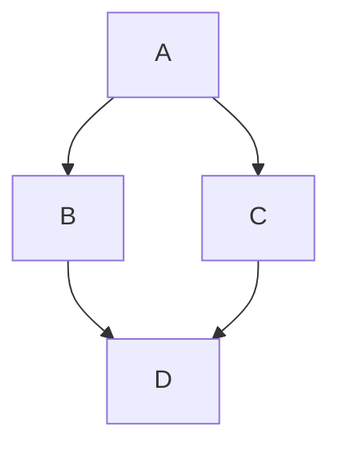

# Markdown 样式测试文档

本文档用于测试 Markdown 解析器对各种语法元素的支持情况。覆盖标题、段落、文本样式、列表、代码、表格、引用、媒体、脚注、公式等。

## 1. 标题级别

# H1 一级标题
## H2 二级标题
### H3 三级标题
#### H4 四级标题
##### H5 五级标题
###### H6 六级标题

## 2. 文本样式与行内元素

- **粗体文本** 使用 `**` 或 `__`
- *斜体文本* 使用 `*` 或 `_`
- ***粗斜体*** 组合使用
- ~~删除线~~ 使用 `~~`
- `行内代码` 使用反引号
- <u>下划线</u> (部分解析器支持 HTML 标签)
- 上标^示例^ 或 下标~示例~ (非标准，可用 HTML：X<sup>2</sup>, H<sub>2</sub>O)
- ==高亮标记== (需要扩展支持，如 Markdown Extra)
- 行内 [链接](https://example.com) 和 **自动链接**: <https://example.com>
- 脚注示例[^1]

[^1]: 脚注内容：这里是脚注的说明文字，可以很长，支持换行。

## 3. 段落与换行

这是第一段落。段落之间用空行分隔。  
如果需要在段落内换行，在行末添加两个空格（如上）然后回车。

## 4. 列表

### 无序列表

- 项目 1
- 项目 2
  - 嵌套项目 2.1
  - 嵌套项目 2.2
- 项目 3

### 有序列表

1. 第一项
2. 第二项
   1. 嵌套有序 2.1
   2. 嵌套有序 2.2
3. 第三项

### 任务列表 (GFM)

- [x] 已完成任务
- [ ] 未完成任务
- [ ] 子任务
  - [x] 子任务 1
  - [ ] 子任务 2

### 定义列表 (某些扩展)

术语
: 定义内容，支持多行定义。

## 5. 代码块

行内代码示例：`const message = "Hello, world!";`

代码块（支持语法高亮）：

```javascript
function greet(name) {
    console.log(`Hello, ${name}!`);
}
greet('Markdown');
```

```python
# Python 示例
def fibonacci(n):
    a, b = 0, 1
    for _ in range(n):
        yield a
        a, b = b, a + b
```

## 6. 引用块

> 这是一个引用块。
> 可以跨行。
>
> > 嵌套引用块
> > 
> > 继续嵌套内容。
> 
> 回到外层引用。

引用块内也可以包含列表、代码等：

> - 列表项
> - 另一个列表项
>
> ```
> 代码块在引用中
> ```

## 7. 表格 (GFM)

| 左对齐 | 居中对齐 | 右对齐 |
| :----- | :------: | -----: |
| 单元格1 | 单元格2  | 单元格3 |
| 长内容测试 | 居中内容 | 右对齐内容 |
| 混合 `代码` | **粗体** | *斜体* |

复杂表格示例（多行表头等）：

| 水果    | 价格 | 数量 |
|---------|------|------|
| 苹果    | $1.2 | 10   |
| 香蕉    | $0.5 | 20   |
| 橘子    | $0.8 | 15   |

## 8. 图片

内联图片（相对路径或URL）：


带链接的图片：

[](https://example.com)

## 9. 水平线

三种写法：

---

***

___

## 10. 链接与自动识别

- [带标题的链接](https://example.com "示例网站")
- 引用式链接：[一个示例][id]
- 自动链接：https://github.com 和 email@example.com (部分解析器支持自动识别)

[id]: https://example.com/reference "引用链接说明"

## 11. HTML 标签支持

<p style="color: red;">这段文字使用 HTML 标签显示为红色（如果解析器允许）。</p>

<div align="center">
  <b>居中的粗体文本</b>
</div>

## 12. 转义字符

\*星号\* \_下划线\_ \{大括号\} \[方括号\] \#井号 \>大于号 等。

## 13. 特殊符号与 Emoji

常用符号：© ® ™ ° ± × ÷  
Emoji（依赖渲染器支持）：😀 🚀 ❤️ ✅ 🎉  

## 14. 数学公式

行内公式：$E = mc^2$  

块级公式：

$$
\int_{-\infty}^{\infty} e^{-x^2} \, dx = \sqrt{\pi}
$$

$$
\mathbf{X} = \begin{bmatrix}
x_{11} & x_{12} \\
x_{21} & x_{22}
\end{bmatrix}
$$

## 15. 图表与流程图



## 16. 脚注与引用

另一个脚注示例[^another]。

[^another]: 第二个脚注，测试多个脚注。

## 17. 嵌入文件（部分扩展）

!include(example.txt)  // 非标准，仅为示例

## 18. 其他扩展语法

### 警告框 / 提示框 (某些主题)

> [!NOTE]
> 这是一个注意提示。

> [!WARNING]
> 这是一个警告提示。

### 折叠块 (details)

<details>
<summary>点击展开详细内容</summary>

这是折叠区域内的内容。可以包含任意 Markdown 语法。

- 列表项
- **粗体**

</details>

## 19. 综合测试：混合排版

> **重要提示**：  
> 在阅读此文档时，请注意以下事项：
>
> 1. 确保 Markdown 解析器支持 **GFM** 或 **CommonMark**。
> 2. 对于 LaTeX 公式，需要启用数学扩展。
> 3. 对于 Mermaid 图表，需要加载对应库。
>
> 示例代码：
> ```bash
> echo "Hello Markdown"
> ```
>
> 最终结果展示：[查看详情](https://www.markdownguide.org)

---

**测试完成。** 请根据实际渲染效果评估兼容性。